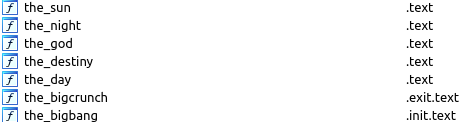
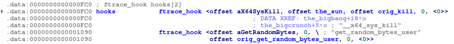
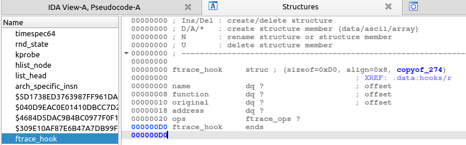

BreizhCTF 2024 - The Intrepid (3/4)
==========================

### Description

*Note à moi-même :*  

J'ai l'impression qu'une charge additionnelle s'est ancrée à la racine même du système Linux. Il faut que je parvienne à l'extraire pour en déterminer ses fonctionnalités.

---

Identifiez :

- Le code décimal, qui passé en argument d'une certaine commande système, permet d'obtenir les privilèges root

Format de flag : `BZHCTF{code_decimal}`  
Exemple de flag : `BZHCTF{94578}`

### Fichiers fournis

- doc_perso_vol3.md

### Recherche des traces de la charge additionnelle

Suite aux analyses effectuées dans la partie 2, nous avons pu identifier que du contenu était récupéré sur l'endpoint `http://82.105.114.101/ko`, puis sauvegardé dans un fichier. Retournons donc dans `ida`, et poursuivons l'analyse de la fonction effectuant ce requêtage.

La ligne suivante attire notre curiosité : 

```c
syscall(175LL, ptr, size, &unk_2020)
```

Un `syscall` est un appel système, auquel il est possible de spécifier le type et de passer des arguments. Ne connaissant pas les numéros par coeur, nous pouvons chercher "syscall 175" sur le Web :

- https://filippo.io/linux-syscall-table/
- https://manpages.debian.org/unstable/manpages-dev/init_module.2.en.html

Le syscall 175 correspond à `init_module` : 

> init_module() loads an ELF image into kernel space, performs any necessary symbol relocations, initializes module parameters to values provided by the caller, and then runs the module's init function. This system call requires privilege.

Intéressant, il semblerait que le contenu récupéré à `http://82.105.114.101/ko`, puis chargé dans un fichier, soit inséré comme module dans le kernel. Afin de vérifier si des indices sur ce module se trouvent dans la mémoire, nous pouvons regarder si des plugins Volatility sont à notre disposition :

```sh
$ vol3 -f intrepid.ram -h | grep -i -C 2 modules
    linux.check_modules.Check_modules
                        Compares module list to sysfs info, if available
    # [...]
    linux.lsmod.Lsmod   Lists loaded kernel modules.
```

`lsmod` est une commande linux connue, permettant de lister les modules actuellement insérés dans le kernel. En l'exécutant, nous retrouvons effectivement une liste de modules ! Néanmoins, il est difficile d'identifier immédiatement des éléments suspects. Tentons le plugin `check_modules` : 

```sh
$ vol3 -f intrepid.ram linux.check_modules
Volatility 3 Framework 2.7.0    Stacking attempts finished                  

Module Address  Module Name

0xffffc0aa02c0  binfnt_misc
```

Cette fois, un seul module apparaît dans la liste des résultats. Regardons rapidement s'il est présent dans la sortie de `linux.lsmod` : 

```sh
$ grep -i 'binfnt_misc'  /tmp/linux.lsmod.txt | wc -l
0
```

Pas de match ici, ce qui est pourtant étrange, car un module classique ne devrait pas être absent de la sortie `lsmod` ? En cherchant `binfnt_misc` [sur le Web](https://www.google.com/search?q=binfnt_misc), nous trouvons de nombreuses références à binf**m**t_misc, mais pas binf**n**t_misc ! Il semblerait que le module tente de se camoufler de certaines commandes systèmes, mais aussi de camoufler son nom : https://attack.mitre.org/techniques/T1036/005/. 

### Récupération de la charge additionnelle

Nous pouvons directement tenter de récupérer le module depuis la mémoire, via Volatility 2 :

```sh
$ mkdir vol2_module_output
$ vol2 -f intrepid.ram --profile LinuxUbuntu_5_15_0-83-generic_5_15_0-83_92_amd64_vol2x64 -D vol2_module_output/ linux_moddump -b 0xffffc0aa02c0
Volatility Foundation Volatility Framework 2.6.1
WARNING : volatility.debug    : NoneObject as string: Invalid offset 0 for dereferencing name as String
ERROR   : volatility.debug    : No section .symtab found. Unable to properly re-create ELF file.
```

Malheureusement, le plugin ne semble pas fonctionner correctement, et n'est pas disponible dans Volatility3. 

Néanmoins, nous savons que le contenu du module a été sauvegardé dans un fichier : 

```c
fd = open("/var", 0x410002);
```

Pourtant `/var` est un nom de dossier, et aucun nom de fichier n'est spécifié. Pour en avoir le cœur net, nous pouvons parser la valeur de "flag d'ouverture" spécifiée dans un `open`. Ce post peut nous mettre sur la piste pour trouver la bonne ressource : 

- https://reverseengineering.stackexchange.com/questions/19352/how-to-get-meaning-of-flags-by-integer

Les valeurs sont disponibles dans le fichier [fcntl.h](https://github.com/torvalds/linux/blob/master/tools/include/uapi/asm-generic/fcntl.h) du kernel Linux. Elles sont ici en octal, et devons donc convertir hex(410002) en octal(020200002). 

Ensuite, il suffit de regarder quels flags ont formés cette valeur :

```
Cible :         020200002
- O_RDWR		 00000002
- O_DIRECTORY	 00200000
- __O_TMPFILE	020000000
```

Le flag `O_TMPFILE` n'est pas forcément courant, mais sa spécification fait sens dans notre contexte :

> If this flag is specified, functions in the open family create an unnamed temporary file. In this case, the pathname argument to the open family of functions (see Opening and Closing Files) is interpreted as the directory in which the temporary file is created (thus determining the file system which provides the storage for the file). The O_TMPFILE flag must be combined with O_WRONLY or O_RDWR, and the mode argument is required.

source : https://www.gnu.org/software/libc/manual/html_node/Open_002dtime-Flags.html#index-O_005fTMPFILE

Un fichier temporaire, accessible uniquement par le processus malveillant, a été crée sur le système dà la racine du répertoire `/var`. Avec Volatility2, nous pouvons en inspecter le contenu :

```sh
$ vol2 -f intrepid.ram --profile LinuxUbuntu_5_15_0-83-generic_5_15_0-83_92_amd64_vol2x64 linux_enumerate_files > /tmp/linux_enumerate_files.txt
```

Puis, directement dans le fichier : 


Le fichier `/var/#1704168` n'est pas courant, et pourrait être celui généré aléatoirement via l'utilisation du flag `O_TMPFILE`. Nous pouvons l'extraire avec cette commande : 

```sh
$ mkdir -p vol2_module_output
$ vol2 -f intrepid.ram --profile LinuxUbuntu_5_15_0-83-generic_5_15_0-83_92_amd64_vol2x64 linux_find_file -i 0xffff9182503b9810 -O vol2_module_output/1704168
```

Une fois extrait : 

```sh
$ file vol2_module_output/1704168 
vol2_module_output/1704168: ELF 64-bit LSB relocatable, x86-64, version 1 (SYSV), BuildID[sha1]=3282d0a11e1c47ea81ed3046a682dbc11c572532, with debug_info, not stripped
$ sha256sum vol2_module_output/1704168 
ca19d2ad4f71727ec905d133664c635ac535cb20d497ffe5911401bdbf22cce1  vol2_module_output/1704168
```

Il semblerait que nous disposions bel et bien du module chargé en mémoire, qui dispose d'ailleurs des symboles de debug !

### Analyse du module

Ouvrons ida de nouveau, afin de réaliser le reverse engineering. Nous pouvons immédiatement remarquer ces noms de fonction : 



#### Fonction "the_bigbang"

Chaque nom de fonction devrait nous donner des indices sur leur utilité. En toute logique, commençons par regarder `the_bigbang` : 

```c
__int64 __fastcall the_bigbang(__int64 a1)
{
  unsigned int v1; // r8d

  _fentry__(a1);
  _this_module.num_gpl_syms = (unsigned int)prandom_u32() % 0x9C41 + 0x2710;
  v1 = fh_install_hooks(hooks, 2uLL);
  if ( !v1 )
    the_night();
  return v1;
}
```

La fonction `fh_install_hooks` n'étant pas forcément explicite à première vue, nous pouvons taper son nom sur le Web, pour voir si des informations ressortes. En effet, cette fonction appartient à une librairie d'aide à la création de rootkits : 

- https://github.com/xcellerator/linux_kernel_hacking/blob/master/3_RootkitTechniques/3.3_set_root/ftrace_helper.h

*TL;DR* : Cette librairie permet d'insérer des "hooks" sur le système, via "Function Tracer" ou [`ftrace`](https://www.kernel.org/doc/html/v5.0/trace/ftrace.html), qui est un utilitaire permettant de diagnostiquer le kernel. En résumé, il est possible de s'accrocher à une fonction kernel (syscall), afin d'en modifier le fonctionnement (en temps normal à des fins de débogage).

Il ne nous sera pas nécessaire de comprendre son fonctionnement, mais plutôt de regarder quels paramètres y sont passés : 



Afin d'y voir plus clair, inspectons le format de la structure `ftrace_hook` :



Nous pouvons ainsi déduire :

- hook 1 : syscall `__x64_sys_kill` attaché à la fonction `the_sun` du module
- hook 2 : syscall `get_random_bytes_user` attaché à une fonction du module (mais qui ne semble pas clairement spécifiée par ida ici)

Le hooking de `__x64_sys_kill` va notamment permettre de contrôler les appels réalisés par la commande Linux `kill`. Nous pouvons commencer à faire un rapprochement avec le calcul entre deux appels `kill` à la deuxième étape de la série de challenges.

Le hooking de `get_random_bytes_user` n'est pas encore très clair. Pour le moment, nous poursuivons l'analyse du code.

#### Fonction "the_bigcrunch"

Cette fonction est appelée lorsque le module est désengagé du kernel, et retire les hooks mis en place. Cela fait sens avec son nom :

> En cosmologie, le Big Crunch ou effondrement terminal1 est un des possibles destins de l'Univers. Il désigne l'effondrement de l'Univers, c'est-à-dire une phase de contraction faisant suite à la phase d'expansion.


#### Fonction "the_sun"

```c
__int64 __fastcall the_sun(const pt_regs *regs)
{
  unsigned __int64 di; // rax
  __int64 v3; // rax

  _fentry__(regs);
  di = regs->di;
  if ( _this_module.num_gpl_syms == (_DWORD)di )
  {
    v3 = prepare_creds();
    if ( !v3 )
      return orig_kill(regs);
    *(_QWORD *)(v3 + 4) = 0LL;
    *(_QWORD *)(v3 + 0xC) = 0LL;
    *(_QWORD *)(v3 + 0x14) = 0LL;
    *(_QWORD *)(v3 + 0x1C) = 0LL;
    commit_creds(v3);
    return orig_kill(regs);
  }
  else
  {
    if ( (_DWORD)di == 9119 )
    {
      if ( hidden )
      {
        if ( hidden == 1 )
          the_day((__int64)regs);
      }
      else
      {
        the_night((__int64)regs);
      }
      return orig_kill(regs);
    }
    if ( (_DWORD)di != 9120 )
      return orig_kill(regs);
    msleep(3000LL);
    return orig_kill(regs);
  }
}
```

Voici la fonction gérant les appels à `__x64_sys_kill` (et donc la commande Linux `kill`). Une première comparaison entre le registre `di` et la valeur de `_this_module.num_gpl_syms`. `di` contient le numéro de processus (cf : `kill 100` -> `di` est égal à 100). Si la comparaison est vraie, la fonction `prepare_creds` est appelée, puis des valeurs sont assignées à la variable créée. Un tour rapide dans le code source Linux : 

https://www.google.com/search?q=prepare_creds -> https://elixir.bootlin.com/linux/v4.3/ident/prepare_creds -> https://elixir.bootlin.com/linux/v4.3/source/include/linux/cred.h#L163 :

```c
extern struct cred *prepare_creds(void);
```

`prepare_creds` instancie une structure de type `cred` que voici :

```c
struct cred {
	atomic_t	usage;
    // [...]
	kuid_t		uid;		/* real UID of the task */
	kgid_t		gid;		/* real GID of the task */
	kuid_t		suid;		/* saved UID of the task */
	kgid_t		sgid;		/* saved GID of the task */
	kuid_t		euid;		/* effective UID of the task */
	kgid_t		egid;		/* effective GID of the task */
	kuid_t		fsuid;		/* UID for VFS ops */
	kgid_t		fsgid;		/* GID for VFS ops */
```

Sans chercher à positionner exactement chaque argument, nous pouvons déduire que le programme assigne la valeur `0` aux premiers paramètres de cette structure. L'uid `0` étant celui de root, il s'agit probablement de la logique utilisée pour obtenir les privilèges root via une commande système ! Une fois cela fait, [`commit_creds`](https://www.kernel.org/doc/Documentation/security/credentials.txt) est appelé :

> When the credential set is ready, it should be committed to the current process
by calling:  
	int commit_creds(struct cred *new);


L'embranchement `else` permet d'afficher ou cacher le rootkit, lorsque le numéro de processus passé est `9119`, mais aussi de faire un `sleep` pendant 3 secondes lorsqu'il est égal à `9120`. Nous pouvons désormais affirmer que le programme malveillant au pid `3791` effectue une vérification prélable de la présence du rootkit, avant de s'exécuter.

Bien, nous savons désormais qu'il est possible d'élever ses pribilèges en root, mais le paramètre à passer ne semble pas fixe : 

```c
_this_module.num_gpl_syms
```

`_this_module` représente la structure du kernel dans le module (voir https://stackoverflow.com/questions/19467150/what-is-the-significance-of-this-module-in-linux-kernel-module-drivers). Vu que nous disposons d'une capture mémoire, pourquoi ne pas accéder directement à la structure du kernel et récupérer la valeur de la propriété `num_gpl_syms` ?

*NB :* La fonction `the_god` suit exactement la même logique pour élever ses privilèges, mais le compilateur/ida a directement inscrit son code dans `the_sun`. 

### Visualisation de la structure du module avec Volshell

Le challenge s'accompagne d'un document nommé `doc_perso_vol3.md`, et va nous aider à construire une représentation mémoire de notre module ! 

Néanmoins, l'outil exact n'est pas spécifié, même s'il est intégré à Volatility. Un rapide tour dans la [documentation](https://volatility3.readthedocs.io/en/latest/) fait ressortir le nom [`Volshell`](https://volatility3.readthedocs.io/en/latest/volshell.html). Nous pouvons le démarrer de la manière suivante : 

```sh
# -l pour un dump Linux
$ volshell.py -f intrepid.ram -l
Volshell (Volatility 3 Framework) 2.7.0
Readline imported successfully  Stacking attempts finished                  

    Call help() to see available functions

    Volshell mode        : Linux
    Current Layer        : layer_name
    Current Symbol Table : symbol_table_name1
    Current Kernel Name  : kernel

(layer_name) >>> 
```

Nous avons accès à un interpréteur Python, et cela fait à première vue sens avec la documentation du challenge. Il nous suffit désormais de combler les trous : 

- type_objet : `module` (facilement déductible, ou par un peu de recherche sur le Web : https://elixir.bootlin.com/linux/v5.17.11/source/include/linux/module.h#L365)
- adresse_objet : `0xffffc0aa02c0` (obtenu via la commande Volatility3 `linux.check_modules`)

Finalement : 

```python
(layer_name) >>> # Déclarer l'objet kernel
(layer_name) >>> kernel = self.context.modules[self.config["kernel"]]
(layer_name) >>> # Construire un objet du kernel, en se basant sur son type et son adresse en mémoire 
(layer_name) >>> objet = kernel.object("module", 0xffffc0aa02c0, absolute=True) 
```

Suivons les conseils de la documentation, et regardons les commandes à notre disposition avec `help()`. En premier, nous remarquons : 

```
Methods:
* dt, display_type
    Display Type describes the members of a particular object in alphabetical order
```

Essayons alors :

```python
(layer_name) >>> dt(objet)
symbol_table_name1!module (896 bytes)
   0x0 :   state                       symbol_table_name1!enum                  0xffffc0aa02c0
   0x8 :   list                        symbol_table_name1!list_head             0xffffc0aa02c8
  0x18 :   name                        symbol_table_name1!array                 ['98', '105', '110', '102', '110', '116', '95', '109', '105', '115', '99', '0', '0', '0', '0', '0', '0', '0', '0', '0', '0', '0', '0', '0', '0', '0', '0', '0', '0', '0', '0', '0', '0', '0', '0', '0', '0', '0', '0', '0', '0', '0', '0', '0', '0', '0', '0', '0', '0', '0', '0', '0', '0', '0', '0', '0']
  0x50 :   mkobj                       symbol_table_name1!module_kobject        0xffffc0aa0310
  0xb0 :   modinfo_attrs               symbol_table_name1!pointer               159988867616768
  0xb8 :   version                     symbol_table_name1!pointer               0
  0xc0 :   srcversion                  symbol_table_name1!pointer               159988715836768
  0xc8 :   holders_dir                 symbol_table_name1!pointer               159988669718080
  0xd0 :   syms                        symbol_table_name1!pointer               0
  0xd8 :   crcs                        symbol_table_name1!pointer               0
  0xe0 :   num_syms                    symbol_table_name1!unsigned int          0
  0xe8 :   param_lock                  symbol_table_name1!mutex                 0xffffc0aa03a8
 0x108 :   kp                          symbol_table_name1!pointer               0
 0x110 :   num_kp                      symbol_table_name1!unsigned int          0
 0x114 :   num_gpl_syms                symbol_table_name1!unsigned int          24937
```

Extra, nous disposons d'une vue de la structure du module malveillnt en mémoire ! Rapidement, nous pouvons identifier la valeur de `num_gpl_syms` : 24937.

Une importante partie du travail a été effectuée, car nous avons récupéré le module malveillant, compris sa structure et identifié presque toutes ses fonctionnalités. Désormais, nous pouvons finaliser notre analyse avec la dernière partie de cette série de challenges.

### Flag

- Le code décimal, qui passé en argument d'une certaine commande système, permet d'obtenir les privilèges root : `24937`

`BZHCTF{24937}`
