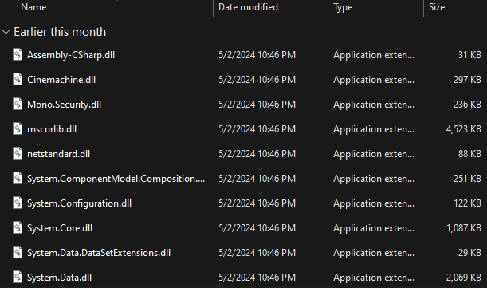

_Pour cette seconde tâche, Galahad a pour mission d'allumer une torche placée devant l'entrée du village menant au dangereux Pont de l'épée. Pour cela, Merlin lui a confié un puissant sort permettant de tirer des boules de feu. Mais notre héros a oublié comment le déclencher... Aidez-le à retrouver la mémoire et à lancer une boule de feu sur la torche pour l'enflammer._

# Introduction

Il est important de préciser que la solution ici présentée n'est pas la seule susceptible de fonctionner.

# I - Analyse de l'objectif

Dans le jeu, nous retrouvons près de la porte menant au Pont de l'épée, une petite torche avec un texte mentionnant "Light me up !". Notre objectif est donc de l'embraser en y jetant une boule de feu. Cependant nous ne possédons aucun moyen dans l'état actuel pour générer des boules de feu.

Pour y parvenir, rien de tel qu'un peu de rétro-ingénierie.

# II - Rétro-ingénierie Unity

Si vous avez déjà cherché à comprendre/modifier le comportement d'un jeu réalisé avec Unity vous savez déjà où chercher, sinon Google est votre ami. En l'occurrence la logique d'un jeu Unity est contenu dans la bibliothèque dynamique `Assembly-CSharp.dll`, comme son nom l'indique elle a été assemblée depuis le langage `C#` et appartient donc au framework `.NET`.

Pour analyser du `.NET` un des meilleurs logiciels gratuits est sans nul doute `DNSpy`. Ouvrons notre bibliothèque dans ce logiciel.

On retrouve des `Controller`, des scripts réalisés en `C#` permettant de définir le comportement d'un objet Unity. Penchons-nous sur le `PlayerController`.

Quelques fonctions et un paquet d'attributs sont disponibles. Après un bref coup d'oeil, l'un des attributs nous interpelle.

Quel genre de développeur appellerait une de ses variables `some_bool`. Analysons-là pour obtenir ses références dans le code.

Nous en trouvons une dans la méthode `Update`, une méthode appelée en permanence par le moteur de `Unity` sur chacun des objets.

Regardons le code de cette méthode.

Oui j'ai mis un peu d'obfuscation mais cela reste lisible. On reconnaît bien dans la seconde condition un code permettant d'instancier une boule de feu. Mais alors que nécessite cette condition. Tout d'abord, un clic sur le bouton gauche de la souris (`GetMouseButtonDown(0)`), ensuite que `this.fireball == null` (ce qui signifie qu'une seule boule de feu peut être instanciée à la fois), que le joueur soit sur le sol (`this.on_ground`) et que le mystérieux booléen `some_bool` soit vrai. Il n'y a désormais plus de doute sur le fait que ce booléen est la clé de notre pouvoir à lancer des boules de feu. Une façon de le rendre vrai serait de le réécrire en live depuis Cheat Engine. Mais pour cela il nous faut connaître son adresse, mais scanner un booléen qui est toujours faux... c'est impossible. Regardons les autres attributs.

La variable de la santé `health` nous est clairement affichée en haut à gauche de l'écran et présente l'avantage d'être à un octet fixe plus loin que `some_bool` (0x4000065 vs 0x4000064).

# III - Scanning mémoire

Scannons donc la santé de notre personnage. Par défaut elle est à 255 et est bien entendu de type `byte`.

Oui mais comment la faire descendre ? Si vous vous êtes un peu baladé sur le jeu, ou que vous avez davantage creusé la rétro-ingénierie, vous remarquerez que le Pont de l'épée vous fait perdre de la vie. Amusez-vous donc à marcher dessus et à effectuer 2 ou 3 scans pour isoler la variable `health`.

Une fois récupérée, copiez son adresse.

Puis cliquez sur `Add Address Manually`.

Créez une nouvelle variable nommée `some_bool` située un octet avant votre variable `health`.

# Résolution

Changez la valeur de votre nouvelle variable à 1 pour mettre le booléen à vrai. Puis retournez dans le jeu.
Et après un clic gauche... Magie !

  

Rendez-vous donc au niveau de la torche et embrasez-là !

Le flag est à vous !

Le flag est donc `BZHCTF{a_great_way_to_lower_heating_bills}`

# Conclusion

Ce challenge avait pour but de faire découvrir les bases de la rétro-ingénierie d'un jeu créé sous Unity ainsi que de renforcer légèrement la prise en main de Cheat Engine.
