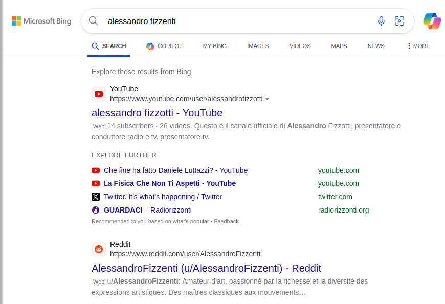
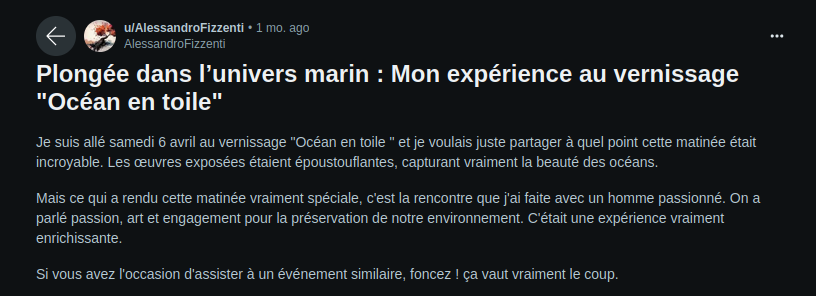

## 1 - La Grande Vague
On apprend l'existence d'un certain Alessandro Fizzenti. Il nous est demandé de trouver un vernissage auquel il s'est rendu ayant eu un impact sur sa vie.

On cherche sur Google si des informations remontent. Pas grand chose d'intéressant. On essaye la recherche sur différents moteurs de recherche. Bing nous donne un résultat intéressant. Le compte remonte également sur Duckduck go.
Si on recherche "AlessandroFizzenti" le compte remonte également sur Google et Yandex.

En se rendant sur le compte d'Alessandro on voit qu'il y a plusieurs posts. Celui-ci semble être un amateur d'art. En parcourant les posts il insiste sur le caractère incroyable d'un des vernissages qu'il a fait: `Plongée dans l’univers marin : Mon expérience au vernissage "Océan en toile"`.

Le flag est donc: `BZHCTF{Océan_en_toile}`
