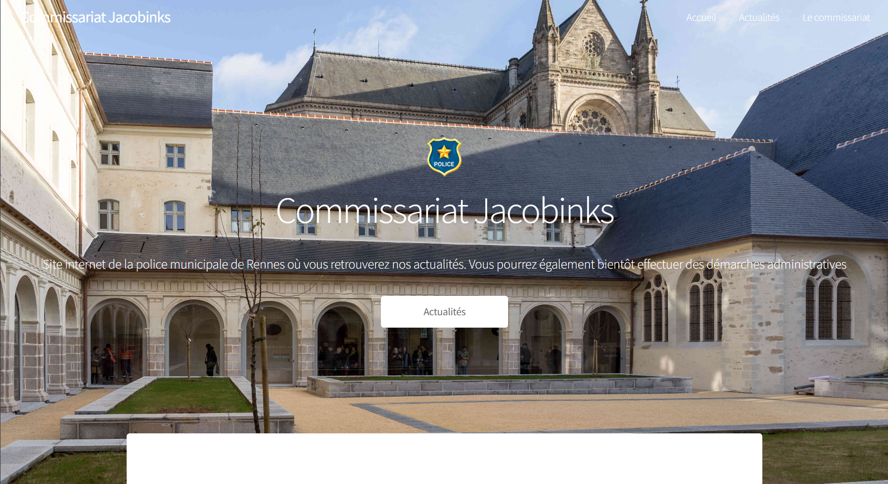

# 4 - Crime aux Dieux

## Catégorie
**Enquête/OSINT**

## <u>**Description**</u>

 

> Il est désormais nécessaire de s'intéresser à la victime de ce vol odieux, Félicien de Grace fils de Gastien de la Plougarnel.  
Vous trouverez, sur l'intranet de votre Direction, les données de monsieur de Grace qui ont été copiées dans le cadre de l'enquête.  
D'après nos informations, Félicien se serait visiblement brouillé avec Alcibiade ; ce qui aurait en partie conduit au vol. Fouillez ses données, retrouvez les traces de cette querelle et identifiez leur dernier échange.  
En cas de besoin, consultez vos collègues enquêteurs.

***Format : BZHCTF{JJMMAA:HHhMM}***  

## <u>**Auteur**</u>

***ASTRE***

## <u>**Solution**</u>

### Analyse du PDF

L'analyse du PDF joint au challenge s'avère intéressante et apporte du contexte au challenge.  Ce document permet d'apprendre que la victime `Félicien de Grace fils de Gastien de la Plougarnel` a porté plainte le 27/04/2024 contre `Alessandro FIZZENTI` pour le motif suivant : "VOL D’UNE COLLECTION DE BUSTES AU SEIN DU DOMICILE PERSONNEL DE LA VICTIME".  
Au-delà de ces rappels, ce document permet d'apprendre que l'affaire a été référencée en tant que `GRA-0741-260424` et que l'agent en charge de l'affaire est l'inspecteur `Antoni Dumoulini`.

Enfin, nous apprenons que le commissariat concerné par le dépôt de plainte est le `Commissariat des Jacobinks` et que ce dernier possède un site internet : `commissariat-jacobinks.ctf.bzh`.

Sachant que la première étape de ce challenge consiste à trouver l'intranet, nous allons nous diriger vers ce site.  

### Accès au site 

Une fois arrivés sur le site, nous sommes accueillis par une page nous indiquant que le site est en maintenance : 

Nous pouvons toutefois apercevoir, par le biais de l'onglet, que le statut du site est actuellement en "pré-production", ce qui confirme que le site est actuellement "en phase de test" : 

Nous allons donc tenter d'accéder à preprod.commissariat-jacobinks.ctf.bzh...

... ce qui fonctionne ! 

### Accès à l'intranet et recherche du bon dossier

En fouillant un peu le site, on ne trouve aucun accès direct (via l'utilisation de boutons) à l'intranet.  
Toutefois, il ne faut pas oublier que le site est actuellement en construction et qu'il est possible que l'intranet ait déjà été implanté, mais sans pouvoir y accéder directement depuis un bouton.  

Nous allons donc tenter de rajouter `/intranet` dans l'url, conformément à la consigne du challenge.

Enfin, pour trouver la bonne archive, nous pouvons utiliser la référence d'affaire trouvée précédemment : `GRA-0741-260424`

### Obtention du mot de passe

Nous sommes désormais face à une page qui nous demande un mot de passe. 

En nous remémorant la consigne du challenge ainsi qu'en prenant en compte la phrase indiquée sur le pop-up et en faisant le lien avec le contexte donné au challenge 0, nous pouvons en déduire qu'il faut SE les personnes portant un hoodie avec un logo d'ASTRE.  

Afin d'obtenir le mot de passe, il faut indiquer aux enquêteurs d'ASTRE la compréhension actuelle de l'affaire tout en expliquant pour quelles raisons l'obtention du mot de passe est nécessaire à la poursuite de l'intrigue. 
Une fois fait, nous obtenons le mot de passe suivant : `wi1XA1GZpsWhc7vpAatV`.

Ce mot de passe permet d'accéder à une nouvelle page et de télécharger un fichier appelé `dump_affaire.7z`.

### Le dump

La fouille du dump semble être l'arborescence utilisateur de Félicien, visiblement extrait depuis sa machine. Cette arborescence permet de trouver des éléments intéressants, notamment : 
- Un contrat de travail au nom de "Gaspard CHAD" ; 
- Des actes de vente de différentes œuvres d'art ; 
- Des photos de vacances et de vernissages ; 
- Les courriers entrants de Félicien.

Les trois premiers éléments ne donnant rien pour ce challenge, nous nous intéressons aux courriers entrants.

Un des mails semble s'apparenter, de par son nom, à une correspondance : `Re - Nouvelle`.

Cet échange, très mouvementé, correspond à une querelle entre Alcibiade et Félicien. On peut y apprendre qu'Alcibiade a été renvoyé par Félicien pour ce qui s'apparente à un manque de sérieux.  

Également, Félicien ne semble pas exempt de tout reproche ; Alcibiade indique avoir déjà "dépassé" les limites pour contenter son ex-ami et collègue.  

La conversation se termine par une menace de la part de monsieur VAILLANCOUR envers la victime : `Fais bien attention à toi, c’est pas la dernière fois qu’on se croise !`.  
Ce message a été envoyé le `05 avril 2024 à 18h04`.

**Format : BZHCTF{05042024:18h04}**

>N'hésitez pas à consulter la solution des autres challenges ainsi que le vernissage temporaire "Beauté Céleste" : https://visit.virtualartgallery.com/beauteceleste