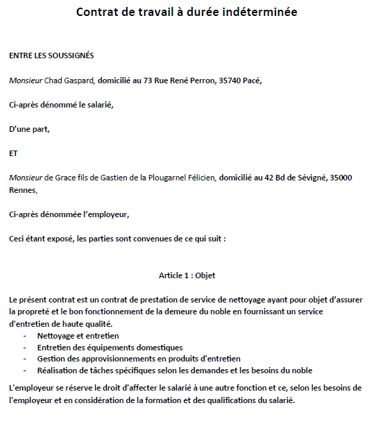
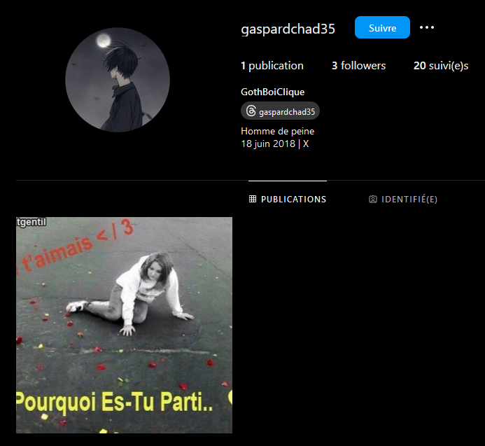
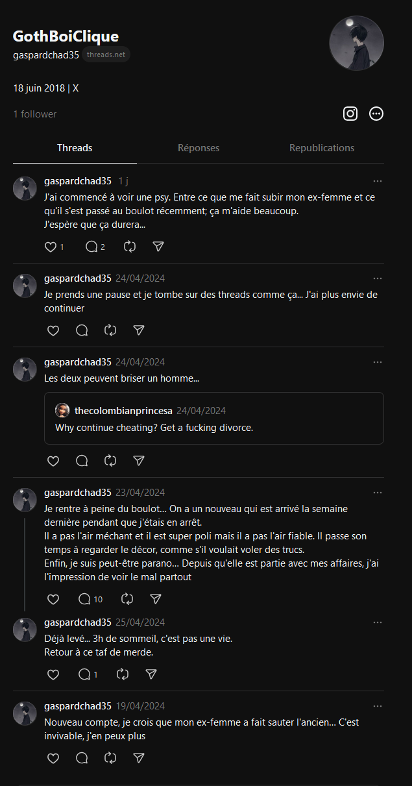
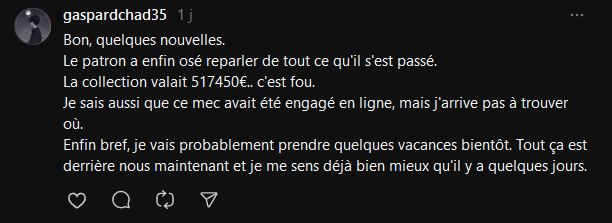

## 5 - Homme de peine

On apprend qu'une personne a assisté au vol. Lors du challenge précédent, en fouillant dans le dump, nous avons pu trouver le contrat de travail d'un certain Gaspard Chad.

En lisant la description, nous découvrons que Gaspard aurait parlé d'Alessandro sur un réseau social. En cherchant sur différents réseaux sociaux, nous trouvons ce qui semble être son compte Instagram, "gaspardchad35", qui peut être trouvé en utilisant son nom, prénom, et le nombre 35 en référence à l'Ille-et-Vilaine (fonctionne également avec "Gaspard Chad"). En visitant ce profil, nous remarquons dans la bio le terme "Homme de peine", ce qui confirme son identité. 

Sur le profil Instagram, il n'y a qu'une seule photo publiée, mais l'information importante est que Gaspard a créé un compte Threads. En cliquant sur le bouton, nous sommes redirigés sur Threads où différents posts sont visibles. 

L'un d'entre eux semble parler d'un "nouveau" au travail, ce qui amène Gaspard à avoir des doutes. En déroulant le post, on peut voir Gaspard expliquer qu'il a vu le nouveau (Alessandro) voler les bustes et que quelques jours plus tard, il a été auditionné par la police.
Dans le dernier message du post, il donne quelques nouvelles et mentionne le montant total du vol : 517 450 €. 

Le flag est donc BZHCTF{517450}
