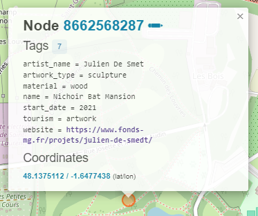

# 6 - The Dark Knight

## Catégorie
**Enquête/OSINT**

## <u>**Description**</u>

 

>Alessandro a été arrêté et interrogé par l'officier Antoni DUMOULINI.
Le suspect semble avoir été persuadé d'indiquer l'endroit où les bustes sont cachés ; retrouvez les coordonnées GPS de cet endroit.  
***Format : BZHCTF{XX.XXXXXX, -X.XXXXXX}***  

## <u>**Auteur**</u>

***ASTRE***

## <u>**Solution**</u>

### Analyse du fichier audio

L'audio correspond à l'interrogatoire d'Alessandro par un inspecteur de police.  
Durant son interrogatoire, le suspect rechigne à donner l'emplacement où les bustes sont enterrés mais finit finalement par craquer à 2 minutes 07.  
Il déclare : "Les bustes sont en enterrés dans un parc au nord de Rennes. Je les ai placés sous une sculpture étrange, une sorte de pyramide inversée. Elle est proche d'un point d'eau."  

### Recherche du lieu 

La première étape consiste à chercher le parc dont parle Alessandro.

En prenant une carte de Rennes, on se rend rapidement compte qu'un parc, visiblement très grand, se trouve au nord-est de la ville ; nous allons donc nous focaliser sur ce dernier.


L'étape suivante consiste à trouver la sculpture étrange, qui se trouve près d'un point d'eau.  

Afin de faciliter la recherche, nous allons donc faire appel à [overpass turbo](https://overpass-turbo.eu/) avec la requête suivante : 

```
// Temps avant que la recherche n'expire 
[out:json][timeout:999];
// Permet de récupérer les résultats 
(
  // Permet de récupérer tous les points d'eau dans une zone définie
  nwr["natural"="water"]({{bbox}});
)->.water;

(
  // Permet de récupérer toutes les oeuvres d'art à moins de 100 mètres des points d'eaux.
  nwr(around.water:100)["tourism"="artwork"];
)->.artwork;

// Afficher les résultats.
out body;
>;
out skel qt;
```

La recherche, focalisée sur le parc via la sélection manuelle des limites bbox, donne le résultat suivant : 


Nous pouvons obtenir plus d'informations sur le lieu qui a été identifié en cliquant sur le rond correspondant : 



La sculpture "Bat Mansion" créée par Julien De Smet et correspondant visiblement à un nichoir, pourrait être la fameuse "pyramide inversée".  

En consultant le site, on peut observer que ce nichoir colle très bien à la description donnée par Alessandro.  


Il ne reste donc plus qu'à relever les coordonnées géographiques trouvées précédemment et à les adapter au format demandé ; soit 4 chiffres après la virgule.

**Flag : BZHCTF{48.1375, -1.6477}**

>N'hésitez pas à consulter la solution des autres challenges ainsi que le vernissage temporaire "Beauté Céleste" : https://visit.virtualartgallery.com/beauteceleste