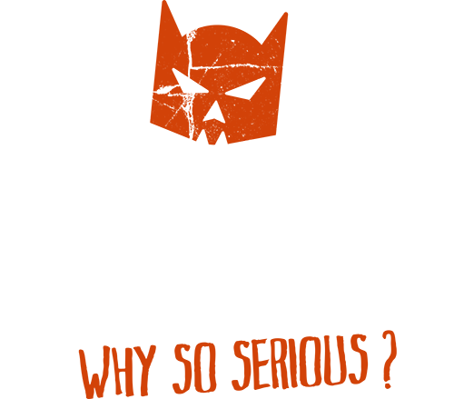
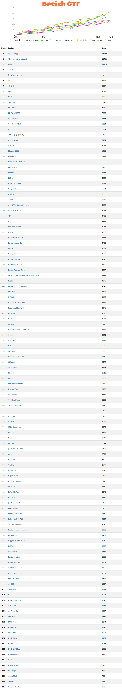
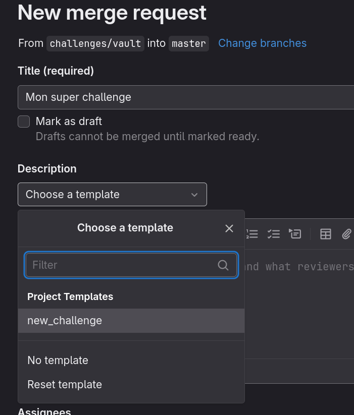
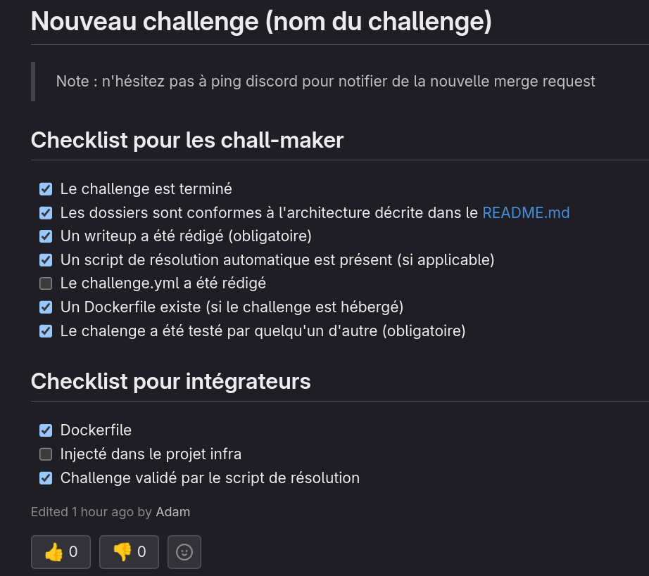

# Breizh CTF 2024




## Pool (par ordre alphabétique)

**Main**
- [BDI](https://www.bdi.fr/fr/accueil/) (Organisateur)
- [Kaluche](https://x.com/kaluche_) (Co-fondateur, lead pool technique)
- [SaxX](https://x.com/_SaxX_) (Co-fondateur)

**Chall Makers**
- [Abyss Watcher](https://github.com/Abyss-W4tcher)
- [HellDiner](https://x.com/DinerHell)
- [Itarow](https://x.com/0xitarow)
- [Kira](/)
- [W00dy](https://x.com/Gaburall)
- [Worty](https://x.com/_Worty)

**Osint Makers**
- [Acami](/)
- [Anonyme 1](/)
- [Anonyme 2](/)
- [KØDA](/)
- [Shinji](https://x.com/shinji_01h)
- [Spownark](https://x.com/Spow_nark)


**Infra Makers**
- [La Brosse Adam](https://twitter.com/adam_le_bon)
- [ShAdE](/)
- [Slinky](https://x.com/HGSlinky)
- [Sp4rKy](https://x.com/__Sp4rKy__)
- [Zeecka](https://x.com/Zeecka_)

## Full Scoreboard !



# Challenges Breizh CTF 2024

Répo contenant les challenges du Breizh CTF 2024

## Suivi des challenges

La développement, le test et l'intégration des challenges sont suivi dans le Google Sheet : `TODO`.


## Développement d'un challenge

Le cycle de vie d'un challenge passe par plusieurs étapes :
1. Développement du challenge sur une branche git dédiée (on ne push pas sur `main` 💀)
2. Création d'une *merge request* dans Gitlab pour demander la validation du challenge par les pairs. N'hésitez pas à le notifier sur Discord. Une ou plusieurs personnes peuvent tester le challenge, mais l'équipe infra doit **forcement** approuver la merge request pour vérifier l'intégration dans l'infrastructure.
3. La merge request est approuvé : le challenge est terminé

### Architecture d'un challenge

Vous trouverez des exemples concrets dans le dossier [_exemple](./_exemple/) du projet.

```
.
└── nom_categorie
    └── nom_challenge
        ├── dist
        ├── README.md
        ├── solve
        └── src
            └── ...
```

> Note : le nom des dossiers doit être sans accents en camel_case (tout en minuscule avec des underscores à la place des espaces)

**Le `README.md` :**
  - Mettez-y l'énoncé, les tags s'il y en a, l'auteur (vous ! afin de savoir à qui s'adresser lors du CTF s'il y a un problème). Et toute information complémentaire. Vous pouvez également mettre une checkbox afin de savoir si le challenge a été testé !

**Dans `src` :**
  - Mettez toutes les sources du challenge.
  - Si le challenge est un challenge hébergé sur un conteneur, mettez-y un `Dockerfile`. Idéalement le Dockerfile devrait utiliser une des images de bases, plus d'informations sur la construction d'un `Dockerfile` dans la section #Dockerfile de ce README.
  - Le dossier `src` ne devrait <u>PAS</u> stocker des binaires compilés. Chaque fichier doit être reproductible en compilant à travers un environnement générique.<br> **Exception** : pour les challenges demandant des actions manuelles tels que les challenges de forensiques ou certains challenges de reverse qui demandent des modifications manuelles, il sera possible de stocker directement vos fichiers sur le git.
  - Concernant les gros fichiers (> 20Mo), ils devront être obligatoirement être stockés en utilisant git LFS. Sans git LFS, ces gros fichiers impacteraient fortement les temps de `git clone` et `git pull` de toute l'équipe.
  - Pensez à configurer les `.gitignore` correctement pour ne pas envoyer de fichiers inutiles tels que les `node_modukes`, les `pycache` ou les dossiers `vendor` de vos projets.

**Dans `files` :**<br>
  - Les fichiers que vous voulez fournir aux joueurs tel que les sources d'un challenge ou les fichiers d'un challenge forensique.
  - Pour les archives de code sources, il serait idéal de créer un script qui zip automatiquement les sources du challenge pour produire le zip en question. Cela évitera de modifier les sources d'un challenge en oubliant de mettre à jour le zip à donner aux joueurs.
  - Pour les binaires compilés, il serait idéal de fournir un script qui compile le binaire dans un docker. Cela permettra d'éviter les différences de compilateurs qui peuvent dépendre de l'OS du chall maker.

**Dans `solve` :**<br>
  - Un `README.md` expliquant la procédure de résolution complète du challenge. Vous pouvez utiliser des spoiler pour ne pas dévoiler toute la solution dès la première ouverture du fichier.
  - Un script permettant de résoudre le challenge automatiquement (permet de vérifier que le challenge fonctionne correctement notamment). Ce script sera utiliser pendant la phase de validation pour vérifier que le challenge fonctionne correctement et pendant le CTF pour vérifier qu'un challenge n'est pas tombé. Ce fichier doit prendre en argument l'adresse où est hébergé le challenge pour aussi bien fonctionné en local qu'à distance.

**Le `challenge.yml` :**<br>
  - Le `challenge.yml` sera utilisé par plusieurs outils automatisés pour configurer le CTFd et déployer l'infrastructure. Remplissez-le en suivant les exemples
  - Faites-attention à la catégorie qui doit commencer par une majuscule. Exemple : `Pwn` `Forensique` `Web`

## Construction d'une image docker

Afin d'homogénéiser les images Docker, plusieurs modèles d'image sont à votre disposition dans le [projet "docker" dans gitlab](/breizh-ctf-2024/docker/container_registry).
L'objectif du dossier `docker` n'est pas de copier son contenu, mais de l'utiliser comme image de base.

Le dossier contient 3 images de base :
- `tcp` qui est une image debian 12 avec socat préconfiguré sur le port 1337. Le programme lancé par socat doit se trouver dans `/challenge/challenge` dans le conteneur. Vous trouverez un exemple d'utilisation [dans le dossier _exemple_tcp](_exemple/_exemple_tcp/src/Dockerfile)
- `web` qui est une image alpine avec apache2+php8 d'installé. La racine du serveur web se trouve dans le dossier `/challenge` du conteneur. Vous trouverez un exemple d'utilisation [dans le dossier _exemple_web](_exemple/_exemple_http/Docker/Dockerfile)
- `python-flask` qui est une image avec nginx configuré pour fonctionner avec un programme uwsgi. Le programme par défaut doit se trouver dans le dossier `/challenge/challenge.py` du conteneur

Si votre challenge assez générique peut utiliser l'une de ces 3 images, utilisez les. Si la nature de votre challenge est trop compliqué pour utilisez l'une de ces images, demandez un avis à la team infra avant de merge votre projet

Vous retrouverez des exemples complets dans le dossier [_exemple](./_exemple/)

## Validation d'un challenge

Le développement d'un challenge se déroule sur une branche dédiée. Lorsque vous êtes prêt à merge un challenge, vous pouvez créer une Merge Request dans Gitlab:
- Menu `Merge request` -> `New merge request`
- Sélectionnez la branche sur laquelle vous avez développée le challenge et continuez
- Pour le titre, renseignez le nom du challenge
- Pour la description, vous pouvez sélectionner le template `new_challenge` 
- Validez la création de la merge request
- Une fois la merge request créée, vous pouvez cocher la checklist pour vérifier que vous avez bien rempli tous les points :
- 
