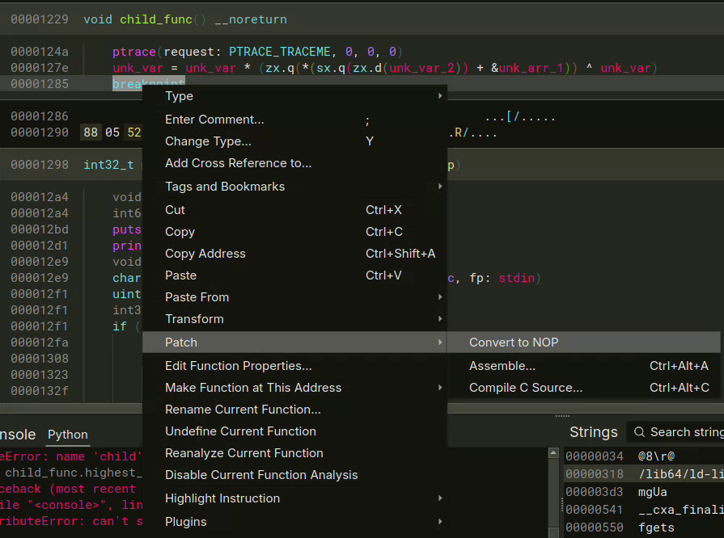

_Ce programme ne paraît pas très complexe. Pourtant, en essayant de le déboguer nos experts se sont heurtés à un comportement surprenant, comme s'il leur manquait une partie des instructions..._

# Introduction

Il me paraît important de préciser que si je réalise dans ce writeup l'analyse de l'exécutable à l'aide d'un désassembleur uniquement (approche statique), un gain de temps considérable pourrait être obtenu via une analyse dynamique à l'aide d'un débogueur.

# I - Analyse globale

La première chose à noter en ouvrant le binaire dans un désassembleur ou via la commande `file` est l'absence de symboles (stripped) ce qui pourrait rendre plus difficile la phase de reverse.


Cependant, on remarque également que le binaire est lié dynamiquement (dynamically linked), nous aurons donc accès aux symboles des bibliothèques dans un désassembleur.

## main

En ouvrant le binaire dans un désassembleur (j'utiliserai BinaryNinja), on commence par analyser la fonction `main`.


J'ai renommé certaines variables de la vue HLIL par commodité.
Nous constatons donc que le programme demande un mot de passe et que sa taille doit être de 0x2b = 43 caractères. Si tel est le cas, le processus se sépare en deux processus distincts via l'appel à `fork`. La seule chose qui différencie ces deux programmes est la valeur de retour de `fork`. Dans le contexte du processus dit parent, c'est le PID du processus dit enfant qui est retourné, cela permet par la suite d'opérer sur le processus enfant depuis le parent, il y a une notion de contrôle à sens unique. Dans le contexte du processus enfant, une valeur nulle est retournée ce qui permet de séparer les flux d'exécution parent/enfant via une condition sur la nullité de la valeur de retour.


Ici, nous observons un appel à la fonction en 0x1229 dans le cadre du processus enfant. En conséquence, nous la renommons `child_func`.
Dans le cadre du processus parent, deux appels à `ptrace` sont effectués suivi d'un `waitpid`. Le premier `ptrace` est appelé avec le paramètre `PTRACE_ATTACH`, il s'agit en effet d'attacher le processus parent au processus enfant pour le manipuler via l'API ptrace. Le second `ptrace` est appelé avec le paramètre `PTRACE_CONT`, ce qui indique au processus enfant de continuer son exécution. Ceci n'aurait aucun intérêt si l'enfant n'était pas arrêté par la suite via un quelconque signal. C'est d'ailleurs ce qu'attend le parent via l'appel à `waitpid`.
Nous reviendrons plus tard sur les instructions du processus parent, enquêtons sur celles du processus enfant contenues dans la fonction `child_func`.
## child_func

Analysons donc la fonction `child_func`. Commençons par noter que BinaryNinja considère que la fonction prend fin lors de l'instruction `int 3` matérialisant un point d'arrêt logiciel.


C'est problématique et nous constatons d'ailleurs des données à la fin de `child_func`, correspondant sans doute à des instructions assemblées.


Nous allons donc remplacer le point d'arrêt par un NOP pour que BinaryNinja désassemble la suite de la fonction.



Voilà qui est bien plus commode ! Pour comprendre où se situe le point d'arrêt que nous venons de neutraliser, nous pourrions regarder le code désassemblé. Mais en comparant avec son ancien emplacement, nous comprenons simplement qu'il se situe entre les deux lignes de la boucle `while`. Cette dernière est d'ailleurs apparue car une instruction de type `jmp` permettant de remonter au début de la boucle, se cachait après le point d'arrêt.


Qu'avons-nous ici ? Tout d'abord, un appel à `ptrace` avec le paramètre `PTRACE_TRACEME`. Le processus enfant permet ainsi au parent de se synchroniser avec lui. Ensuite, une boucle sans fin effectuant deux opérations. Gardons à l'esprit que le processus enfant meurt lorsque le parent meurt, ce qui pourrait expliquer la boucle infinie.
La première opération de la boucle se sert de deux variables globales que j'ai renommées `unk_var` et `unk_var_2` ainsi que d'une adresse dans la section `.data` (`unk_arr_1`) et l'on comprend aisément qu'il s'agit d'aller piocher des éléments à cette adresse. Il s'agit donc d'un tableau que nous renommerons `child_arr` et l'indice des éléments piochés est dans `unk_var_2` que nous renommerons `child_arr_idx`.


Puisque `child_arr_idx` n'est incrémenté que d'une unité à la fois, nous comprenons que `child_arr` est un tableau d'octets. Changeons son type.


Voilà qui est plus lisible ! J'ai pris le soin de renommer `unk_var` en `key_var` car cette variable effectue des opérations arithmétiques et logiques sur l'élément courant du tableau, à la manière d'une clé déchiffrant un contenu.


**AVERTISSEMENT : N'oublions pas qu'entre le déchiffrement du tableau et l'incrémentation de son indice, un point d'arrêt est présent !**

Nous pouvons donc conclure sur le rôle de `child_func`. Cette fonction pioche un élément dans le tableau `child_arr` à l'aide d'un indice incrémental `child_arr_idx`, se sert de `key_var` pour le déchiffrer, puis remplace le contenu de `key_var` par la valeur obtenue. Ensuite, un point d'arrêt permet au parent d'effectuer diverses opérations avant de relancer l'exécution de l'enfant.

## main

Revenons à `main`, la fonction principale du programme qui contient entre autres la logique du processus parent.


Nous avions analysé les trois premières lignes du code du parent. Notons que le premier appel à `waitpid` prend fin lorsque le processus enfant appelle `ptrace` avec `PTRACE_TRACEME`.
Nous rentrons alors dans une boucle `while` et l'on distingue deux conditions de sorties, identifiables par les opérations `break`.
La première d'entre elles est atteinte lorsque la variable `i` est supérieure ou égale à la taille du mot de passe entré par l'utilisateur (soit 43). Dans ce cas, le message de succès est atteint.
La seconde opération `break` est atteinte si la grande condition commençant par `if (zx.q(*((sx.q(zx.d(i)) << 2) + &unk_arr_2)) == key_var` n'est pas vérifiée auquel cas un message d'échec est renvoyé. Tout le but du jeu est donc de valider cette condition à chaque tour dans la boucle, jusqu'à ce que `i` ; qui est incrémenté à chaque tour ; atteigne la taille du mot de passe.
Analysons les lignes précédant cette condition.


Tout d'abord, un appel à `ptrace` avec pour paramètre `PTRACE_POKEDATA` qui écrit à l'adresse de la variable globale `key_var` dans le processus enfant, la valeur du caractère courant du mot de passe saisi. C'est donc chaque caractère du mot de passe qui code la clé déchiffrant le tableau.
Ensuite, un appel à `ptrace` avec pour paramètre `PTRACE_CONT` ce qui aura pour effet de continuer le processus enfant jusqu'au point d'arrêt dans sa boucle `while(true)`.
Autrement dit, lorsque le `waitpid` qui suit est atteint, le processus enfant a sauvegardé dans `key_var` le résultat de l'opération de déchiffrement sur le tableau.
La dernière ligne associe au processus parent la variable `key_var` du processus enfant via l'appel `ptrace` avec le paramètre `PTRACE_PEEKDATA`.

Analysons ensuite chaque membre de la condition validant le caractère courant du mot de passe :
- `zx.q(*((sx.q(zx.d(i)) << 2) + &unk_arr_2)) == key_var` : On identifie aisément qu'un élément est pioché à l'indice `i * 4` (un shift de 2 vers la gauche est équivalent à une multiplication par 4) du tableau `unk_arr_2` que nous renommerons et retyperons donc `uint32_t result_arr_1[0x30]`. Nous obtenons alors la condition `zx.q(result_arr_1[sx.q(zx.d(i))]) == key_var`. Il faut donc égalité entre la variable déchiffrée par le processus enfant à chaque tour, et les valeurs de ce tableau.
- `zx.d(child_arr[sx.q(zx.d(i))] & password[sx.q(zx.d(i))]) == *((sx.q(zx.d(i)) << 2) + &unk_arr_3)` : De même, un élément est pioché à l'indice `i * 4` du tableau `unk_arr_3` que nous renommerons et retyperons `uint32_t result_arr_2[0x30]`. Nous obtenons la condition : `zx.d(child_arr[sx.q(zx.d(i))] & password[sx.q(zx.d(i))]) == result_arr_2[sx.q(zx.d(i))]`. Il faut donc que le caractère courant du mot de passe subissant une opération logique `AND` avec les éléments du tableau `child_arr` soit égal au tableau de résultat `result_arr_2`.

# Synthèse pré-résolution

Résumons ce que nous savons avant de résoudre le problème :
- Tout d'abord, le processus enfant prend en paramètre du parent la variable `key_var` correspondant à `password[i]` et retourne dans `key_var` le résultat de `key_var * (child_arr[i] ^ key_var)` soit `password[i] * (child_arr[i] ^ password[i])`. Appelons la variable intermédiaire qui contient ce résultat `child_res`.
- `child_res` doit respecter la condition : `child_res == result_arr_1[i]`
- `password[i]` doit respecter la condition : `(password[i] & child_arr[i]) == result_arr_2[i]`
En remplaçant `child_res` par sa valeur qui dépend de `password[i]` on a :
- `password[i] * (child_arr[i] ^ password[i]) == result_arr_1[i]`
- `(password[i] & child_arr[i]) == result_arr_2[i]`

# Solution

Il serait judicieux d'utiliser un solveur pour résoudre ces deux conditions, néanmoins par souci de temps et puisque ces conditions ne reposent sur la complexité que d'un octet à la fois, procédons à la réalisation d'un script de bruteforce.

```python
child_arr = [19, 19, 225, 133, 35, 155, 32, 243, 36, 147, 246, 254, 190, 27, 205, 40, 32, 124, 181, 10, 87, 79, 155, 196, 126, 135, 218, 182, 142, 81, 156, 166, 46, 113, 222, 1, 103, 99, 202, 158, 7, 218, 107]     

result_arr_1 = [5346, 6570, 12168, 13266, 9996, 15470, 11193, 10348, 11685, 25132, 9504, 9888, 21800, 6460, 12144, 1225, 6800, 3325, 23086, 3224, 5566, 1520, 27724, 11712, 3135, 24856, 11515, 21000, 9639, 1330, 25245, 7200, 7040, 580, 19608, 2352, 4214, 5700, 17544, 8575, 2640, 20587, 2750]

result_arr_2 = [2, 18, 64, 1, 0, 2, 32, 48, 4, 3, 48, 48, 36, 27, 0, 32, 32, 92, 53, 0, 81, 79, 16, 0, 94, 0, 16, 36, 2, 81, 0, 32, 46, 112, 82, 0, 33, 67, 66, 16, 0, 82, 105]
 
flag = ''

for i in range(len(child_arr)):
    for c_i in range(0, 256):
        if (c_i ^ child_arr[i]) * c_i == result_arr_1[i] and (c_i & child_arr[i]) == result_arr_2[i]:
            flag += chr(c_i)
            break
    
print(flag)
```

Exécutons ce script :


C'est gagné !

# Conclusion

Le challenge avait pour but de faire découvrir aux joueurs débutants les bases de l'API ptrace sans poser de difficulté particulière aux joueurs les plus talentueux.
